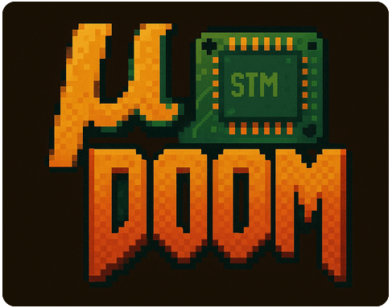

µDoom
=====

Microcontroller Doom — runs classic DOOM on the STM32F769I-Discovery and STM32F7508-DK board.

*“µDOOM is an unofficial port of Doom for STM32 microcontrollers for academic
purposes. This project is not affiliated with or endorsed by id Software.
DOOM is a registered trademark of id Software.”*

Performance:

The STM32F769 runs at a solid setpoint 35 FPS which is nicely VSYNC'd to the display of the
discovery board.
The CPU usage is at about 25 percent when compiled with `-O2` and ignoring the time spend waiting for
the DMA2D transfers to be complete (the CPU is saving power with `__WFI` during that period).
The default build is using `-Og` for smooth debugging.
Worst-case stack usage is about 2KB of 8KB total. Heap usage is a chunk of 84KB.
Zone memory is about 9MB for Doom 2 if a total zone memory of 12M is supplied.
Doom can deal with less memory though.

The STM32F769I-DISCO board uses an LCD display with a 45° tearing effect
limitation during the transition between the front- and backbuffer image though, which
looks ugly.

Toolchain Setup
---------------

Download and extract the ARM GCC toolchain (tested with version 13.3.rel1):

<https://developer.arm.com/downloads/-/arm-gnu-toolchain-downloads>

Extract to a folder.

Edit `config.mk` and point `TOOLCHAIN_ROOT` to that folder (ensure it ends with a slash!).
On Linux e.g.:

    TOOLCHAIN_ROOT= /home/user/arm-gnu-toolchain-13.3.rel1-x86_64-arm-none-eabi/bin/

On Windows e.g.:

    TOOLCHAIN_ROOT=C:/Tools/arm-gnu-toolchain-13.3.rel1-mingw-w64-i686-arm-none-eabi/bin/

Build for the STM32F769I-Discovery Board
----------------------------------------

Run make:

    make -j10

Flashing the resulting `firmware.hex` on the STM32F769I-Discovery Board via
ST-Link:

    make flash

The STM32F769I-Discovery version requires a FAT32 SD card with a .wad file
(e.g.`doom1.wad` from the wad directory) in the SD card root directory.

Build for the STM32F7508 Discovery Board
----------------------------------------

To build the STM32F7508 firmware

In case you've compiled the STM32F769 version first run:

    make clean

Then compile for the STM32F7508:

    make -j10 BOARD=STM32F7508_DK

The STM32F7508 version has a huge flash memory and the `doom1.wad` (Shareware
version) is embedded in the firmware in the build process, so no SD card is
required. But the firmware has to be uploaded on the Quad-SPI flash memory.
This requires the STM32 Cube Programmer from ST with an external loader.
If STM32 Cube Programmer is installed on Windows, just run:

    flash_qspi.bat

or on Linux with a path to the ST programming tool:

    STM32CLT_PATH="$HOME/ST/STM32CubeProgrammer" ./flash_qspi.sh

To load the firmware from QSPI a bootloader is required, flash via:

    cd ST\STM32F7508-Discovery\bootloader
    flash.bat

or on Linux:

    cd ST/STM32F7508-Discovery/bootloader
    ./flash.sh

Flash Tool
----------

To write the firmware to the target device on Windows, download
`STM32_Programmer_CLI.exe` from this package from ST:

    https://www.st.com/en/development-tools/stm32cubeprog.html

Or on Linux the STM32 Cube Programmer is also required if you want to flash to
the STM32F7508 board:

    https://www.st.com/en/development-tools/stm32cubeprog.html

For the STM32F769 (without using QSPI flash) the open source `stlink-tools` are ok as well:

    sudo apt install stlink-tools

Debugger Configuration for VS Code
----------------------------------

On Linux install OpenOCD:

    sudo apt install openocd

On Windows download OpenOCD (tested with version 0.12.0-6):

    https://github.com/xpack-dev-tools/openocd-xpack/releases

Extract to a folder.

Install the Visual Studio Code plugin Cortex-Debug.

Add the following to your VS Code settings.json (adapt paths as needed):

    "cortex-debug.openocdPath.windows": "C:/Tools/xpack-openocd-0.12.0-6/bin/openocd.exe",
    "cortex-debug.gdbPath.windows": "C:/Tools/arm-gnu-toolchain-13.3.rel1-mingw-w64-i686-arm-none-eabi/bin/arm-none-eabi-gdb.exe"

Debugging in VS Code should now work.

Manual Debugging
----------------

(Path examples for Windows, adjust for Linux)

Run OpenOCD with the target board connected:

    C:\Tools\xpack-openocd-0.12.0-6\bin\openocd -f interface/stlink.cfg -f target/stm32f7x.cfg

Run GDB:

    C:\Tools\arm-gnu-toolchain-13.3.rel1-mingw-w64-i686-arm-none-eabi\bin\arm-none-eabi-gdb firmware.elf

In GDB:

    target remote localhost:3333
    monitor reset halt
    load
    break main
    continue

For an additional QSPI firmware in GDB:

    file bootloader.elf

Add main firmware symbols:

    add-symbol-file firmware.elf 0x90000000

Or relative to the bootloader directory:

    add-symbol-file ../../../firmware.elf 0x90000000

    info address Reset_Handler

You see something like:

    Symbol "Reset_Handler" is at 0x08000100 in bootloader.elf
    Symbol "Reset_Handler" is at 0x9003004d in firmware.elf

    break *0x9003004d

(or whatever the real address is)

Debug in GDB with

    n (next)
    s (step)
    si (assembler instruction step)
    finish (to end of function)

With ST-LINK GDB server:

    target remote localhost:XXXX # default port is 6123
    monitor reset
    monitor halt

DMA2D
-----

Doom renders internally into `I_VideoBuffer`, a 320×200 8-bit (L8) framebuffer.
DMA2D is used to convert this to a 32-bit ARGB8888 image for the display.

    ⚠️ Note: DMA2D does not support scaling. Scaling to 640×400 must be done in software.

The color palette is defined in `doomgeneric/stm32f7/i_video.c`:

    static uint32_t dma2d_clut[256];

To load the CLUT:

    DMA2D_CLUTCfgTypeDef clut_cfg = {
        .pCLUT = dma2d_clut,
        .CLUTColorMode = DMA2D_CCM_ARGB8888,
        .Size = 255
    };
    SCB_CleanDCache_by_Addr((uint32_t*)dma2d_clut, sizeof(dma2d_clut));
    HAL_DMA2D_CLUTLoad(&hdma2d, clut_cfg, 1);

Then convert and copy the frame:

    SCB_CleanDCache_by_Addr(src, width * height);
    HAL_DMA2D_Start(&hdma2d,
                    (uint32_t)src, (uint32_t)dst,
                    width, height);

src is the scaled 640×400 8-bit buffer.
dst is the ARGB framebuffer in SDRAM.

Display Framebuffer
-------------------

The LCD is initialized with the usual boilerplate code from the STM32F7 BSP:

    BSP_LCD_Init();

Double buffering is used to avoid tearing. Two framebuffers are placed in SDRAM (after enabling it with `BSP_SDRAM_Init()`):

    static uint32_t g_fblist[2];
    g_fblist[0] = 0xC0000000;
    g_fblist[1] = g_fblist[0] + 800 * 480 * 4; // 4 bytes per pixel

Set the initial framebuffer:

    BSP_LCD_LayerDefaultInit(0, g_fblist[0]);

To sync buffer swaps with vertical refresh, use a line event interrupt:

    HAL_LTDC_ProgramLineEvent(&hltdc_discovery, 0);

Handle it like this:

    void HAL_LTDC_LineEventCallback(LTDC_HandleTypeDef *hltdc)
    {
        LTDC_LAYER(hltdc, 0)->CFBAR = g_fblist[g_fbcur];
        __DSB();
        __HAL_LTDC_RELOAD_CONFIG(hltdc);

        g_fbcur = 1 - g_fbcur;
        HAL_LTDC_ProgramLineEvent(hltdc, 0); // request next line event
    }

While one buffer is displayed, Doom draws into the other.

Zone Alloc and Memory Layout
----------------------------

Doom uses its own memory allocator instead of malloc(). It needs about 6 MB of RAM.

This is allocated from SDRAM, after the two framebuffers:

    #define ZONE_BASE_ADDR (0xC0000000 + SOME_OFFSET_INTO_SDRAM)

(Note: in the code this address is not hardcoded but calculated by the linker
script, but basically you need to define some address in the SDRAM.)

Doom calls this at startup:

    uint8_t *I_ZoneBase(int *size)
    {
        *size = NUMBER_OF_BYTES_FOR_Z_MALLOC;
        return (uint8_t*)ZONE_BASE_ADDR;
    }

Make sure this block is large enough and does not overlap with any other DMA
buffers. Also the SDRAM must be initialized and mapped to `0xC0000000` with:

    BSP_SDRAM_Init();

Otherwise the SDRAM is not accessible.
Note that Doom 2 needs significantly more zone memory than Doom 1.

Reading .WAD Files from SD Card
-------------------------------

A bunch of boilerplate code is needed to read data from SD card using FatFS.
The code is located in `ST/STM32F7xx_shared/storage/*`.

To mount the SD card, first initialize the SD driver and link it to a path:

    char sdpath[4];
    FATFS sdfatfs;
    if (FATFS_LinkDriver(&SD_Driver, sdpath) != 0)
    {
        /* error handling */
    }
    FRESULT fr = f_mount(&sdfatfs, (TCHAR const *)sdpath, 1);
    if (fr != FR_OK)
    {
        /* error handling */
    }

As `fopen(...)` and `fread(...)` calls all over the place, the
simplest way is to link the stdio library functions to FatFs in the
`syscalls.c` file by overwriting `_open`, `_lseek`, `_read`, `_write`, and `_close`.
E.g. for  `_open`, this will link fopen to FatFs's `f_open` function.
This is a minimal example to glue a FatFs FIL struct to an fopen call:

    FIL fexample; // Example FatFs file struct
    int _open(const char *path, int flags, ...)
    {
        BYTE fatfs_mode = FA_READ;

        FRESULT fr = f_open(&fexample, path, fatfs_mode);
        if (fr == FR_OK)
        {
            return TBD_YOUR_FILE_HANDLE; // invent an integer file handle here
        }
        errno = EIO;
        return -1;
    }

So `ST/STM32F769I-Discovery/syscalls.c` for a complete implementation.

Bootloader for STM32F7508
-------------------------

The STM32F7508 has 16MB of QSPI flash memory at 0x90000000.
Now the cumbersome part is that this requires a custom bootloader
to initialize the QSPI hardware and then jump to the application code.

The custom bootloader can be placed in the (small) 64KB internal flash memory at
0x08000000. There is a bootloader in the directory `ST/STM32F7508-Discovery/bootloader`.
This bootloader initializes the QSPI flash and then jumps to the application.
Use `make` to build the bootloader. Then run `flash.bat`/`flash.sh` in the directory
`ST/STM32F7508-Discovery/bootloader` to load the bootloader. If you don't want
to compile the bootloader, there is a precompiled binary in the same directory
`bootloader_precompiled.hex`.
The `flash.bat`/`flash.sh` script will also setup the `BOOT_ADD0` address for the board:

    echo === Ensuring BOOT_ADD0 is set to internal flash (0x08000000) ===
    echo Right shift target address by 14 bits (i.e. divide by 16384)
    STM32_Programmer_CLI.exe -c port=SWD -ob BOOT_ADD0=0x2000

So `BOOT_ADD0` is set to 0x2000 (which multiplied by 0x4000 is the target
address of 0x08000000), which points to the internal flash memory.

Development
-----------

Ported to the STM32F7xx by Jan Zwiener, using the DoomGeneric portable Doom
code base.

              | |
     _   _  __| | ___   ___  _ __ ___
    | | | |/ _` |/ _ \ / _ \| '_ ` _ \
    | |_| | (_| | (_) | (_) | | | | | |
     \__,_|\__,_|\___/ \___/|_| |_| |_|

     Doom for the STM32F7 microcontroller

